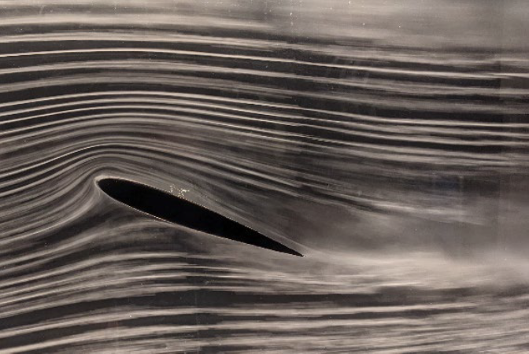

Table of content
- [Experimental Aerodynamics Lab (Wind Tunnel Test)](#experimental-aerodynamics-lab-wind-tunnel-test)
- [Aero/Space engineering Materials](#aerospace-engineering-materials)
- [Aero/Space Structures Instrument Lab (Structures/Stress Test)](#aerospace-structures-instrument-lab-structuresstress-test)
- [Aircraft Preliminary Design (Teaching assistant)](#aircraft-preliminary-design-teaching-assistant)

# Experimental Aerodynamics Lab (Wind Tunnel Test)
This laboratory consists of a sequence of experiments that demonstrate basic aerodynamic theory while developing skills in the use of classic and modern experimental apparatus, the practice of good experimental technique, and the writing of experimental reports. Specific experiments depend on apparatus availability and instructor preference. 

# Aero/Space engineering Materials
Structure, properties, and processing of engineering materials. Crystal structure, defects, imperfections, and strengthening mechanisms. Mechanical properties, fracture mechanics, fatigue and creep, material failures. Phase diagrams and transformations. Degradation of materials. Characteristics of ferrous and nonferrous metals and alloys, ceramics, polymers, and composite materials. Emphasis on materials and processes used in the aerospace industry.

# Aero/Space Structures Instrument Lab (Structures/Stress Test)
Principles of modern aerospace vehicle testing and instrumentation. Basic electrical measurements and devices such as strain gages, piezoelectric sensors, and thermocouples. Topics could include measurement of fluid pressure and flow; temperature; thermal and transport properties; strain; motion; vibration; force and torque. Experimental static and dynamic analysis of structures. Processing and analyzing experimental data; report writing and data presentation.

# Aircraft Preliminary Design (Teaching assistant)
Airplane conceptual design principles are developed to meet modern aerodynamic, propulsion, structural, and performance specifications. A complete airplane is designed, resulting in a design package consisting of specifications, aerodynamic calculations, inboard profile drawing, weight and balance, general arrangement drawing, aerodynamic drag analysis, and complete performance report.